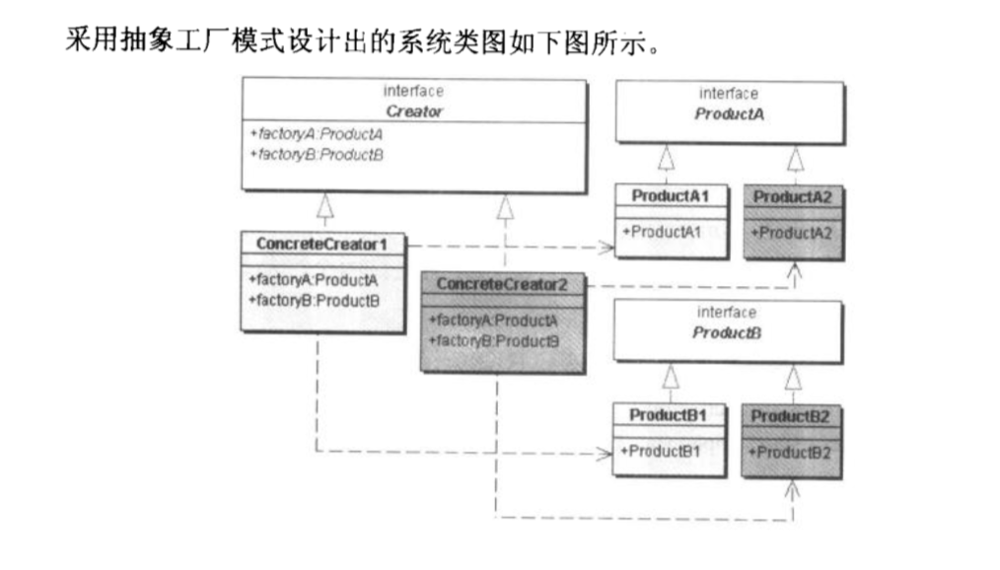

## 简单工厂 / 工厂方法 / 抽象工厂

#### 简单工厂
##### 简单工厂模式

##### 简单工厂 UML

* 工厂类（Creator）
* 抽象产品（Product）
* 具体产品（Concrete Product）

##### 简单工厂优点
* 增加产品类时可以不用修改客户端，是实现了指责分离

##### 简单工厂缺点
* 一定成都上不满足 “开-闭 原则”，如果增加产品类则必须修改工厂类。

##### 简单工厂在 Java 中的应用
DateFormat 类是简单工厂的一个特例，他把"抽象产品"，"具体产品"，"具体工厂"融合起来。

#### 工厂方法
##### 从简单工厂到工厂方法
简单工厂的缺点上面已经介绍过了，工厂方法弥补了简单工厂的缺点， 是简单工厂的抽象和推广。
##### 工厂方法UML

* 抽象工厂（Creator）角色，在实际系统中，这个角色常常使用抽象 Java 类实现。
* 具体工厂（Concrete Creator）角色，实现了抽象工厂接口
* 抽象产品（Product）角色，这个角色常常使用抽象 Java 类实现。
* 具体产品（Concrete Product），这个角色实现了抽象产品所声明的接口。

##### 工厂方法在 Java 中的应用
java.util.Collection 所有继承实现 Collection 的接口都必须实现 iterator() 方法，返回 Iterator 类型的对象。

#### 抽象工厂
##### 工厂方法到抽象工厂
如果，每一个抽象产品都有多余一个具体子类的话，抽象工厂模式面对的问题是多个产品等级结构的系统设计。

##### 抽象工厂 UML

##### 抽象工厂在 Java 中的应用

#### 演进过程
简单工厂不完全遵守"开闭原则"，如果增加一个产品就需要修改具体工厂。工厂方法是简单工厂的进一步抽象，当存在产品等级结构时，对于创建者来说，也需要根据等级进一步抽象，把公共行为提取出来，也就衍生出核心接口类，抽象工厂类，来负责不同产品的创建，工厂方法弥补了简单工厂的缺点。当存在产品族的时候，也就是存在两个不同的产品集合，这时工厂需要进一步抽象，让其负责创建不同产品族的对象。（思路，先构建产品模型，在构建工厂模型，所有的模式都需要向 6 大原则靠拢）